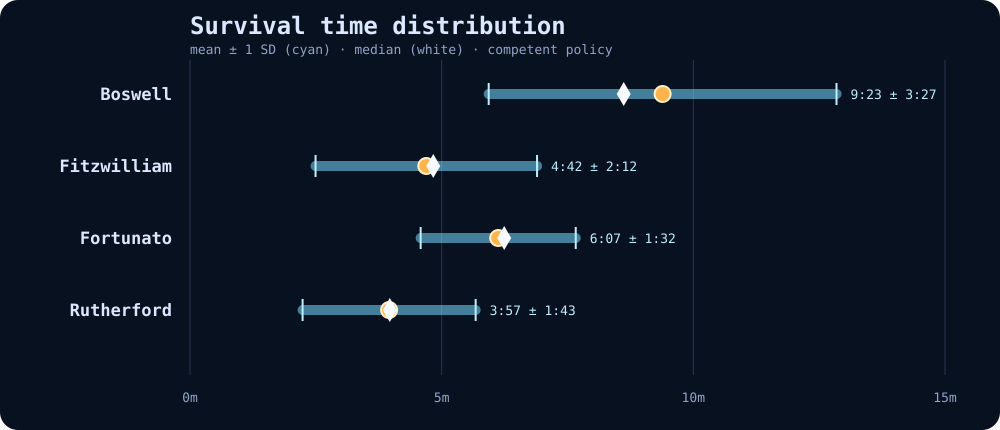

# Survival Benchmark

Balance version: `endless-2.8.0`
Experiment: `endless-2.8.0-final`
Policy: `competent`
Sample: 24 seeded runs per hero; 96 total runs; 30-minute censor limit.

**This file is generated.** Regenerate it with `npm run bench:survival`.
The simulation is a regression instrument, not a substitute for human playtesting.

## Survival distribution

| Hero | Runs | Mean ± SD | 95% CI | Median | P10 | P25 | P75 | P90 | Censored |
| --- | ---: | ---: | ---: | ---: | ---: | ---: | ---: | ---: | ---: |
| Boswell | 24 | 12:03 ± 6:45 | 9:20–14:45 | 12:05 | 4:26 | 5:02 | 19:15 | 20:24 | 0 |
| Fitzwilliam | 24 | 9:20 ± 7:48 | 6:13–12:28 | 4:48 | 2:57 | 3:46 | 12:57 | 22:41 | 0 |
| Fortunato | 24 | 12:25 ± 7:17 | 9:30–15:20 | 9:33 | 4:40 | 6:25 | 20:26 | 22:04 | 0 |
| Rutherford | 24 | 11:34 ± 7:31 | 8:34–14:35 | 12:45 | 2:53 | 4:07 | 18:56 | 20:22 | 0 |

Standard deviation describes spread around the mean. Median and percentiles are
included because endless-run survival is usually skewed rather than normally distributed.
Censored runs reached the safety limit alive and are not treated as observed deaths.

## Provisional Standard-mode contract

This target comes from the founders and remains provisional until simulated policies
are calibrated against human playtests. It is a decision aid, not an automatic tuning order.

| Measure | Target | Observed |
| --- | ---: | ---: |
| Competent median | ≈12:00 | 9:23 |
| Standard deviation | 3:30–4:00 | 7:20 |
| Mean + 2σ | 18:00–20:00 | 26:00 |
| Mean + 3σ | 22:00–24:00 | 33:20 |

## Pressure and agency diagnostics

| Hero | Kills | Elite kills | Mean elites alive | Peak elites alive | Bosses | Mech uptime | Gunship uses | Gunship damage | Kills/use |
| --- | ---: | ---: | ---: | ---: | ---: | ---: | ---: | ---: | ---: |
| Boswell | 3027 | 34.8 | 0.8 | 3.4 | 4.2 | 16.3% | 1.96 | 12268 | 27.9 |
| Fitzwilliam | 2376 | 25.7 | 0.6 | 2.7 | 3.1 | 15.6% | 1.00 | 5659 | 24.2 |
| Fortunato | 3220 | 36.7 | 0.8 | 3.3 | 4.4 | 16.6% | 2.17 | 13257 | 25.3 |
| Rutherford | 3068 | 34.5 | 0.7 | 3.5 | 4.3 | 16.2% | 1.58 | 8972 | 25.3 |

## Leading death sources

- **Boswell:** boss-puddle 7, horde-contact 7, boss-radial 5
- **Fitzwilliam:** horde-contact 15, boss-radial 5, boss-puddle 2
- **Fortunato:** horde-contact 9, boss-puddle 5, boss-radial 5
- **Rutherford:** horde-contact 16, boss-projectile 2, elite-lunge 2

## Methodology

- Runs execute the real deterministic fixed-step simulation without Three.js rendering.
- Every hero receives the same seed set, making spawn and director schedules comparable.
- The policy sees current state only. It has no future RNG, attack outcome, or spawn knowledge.
- Movement, cooldowns, upgrade cards, Cache collection, Protocol selection, bosses and death use production code.
- The competent policy kites local threats, pursues reachable objectives, and uses abilities reactively with a bounded reaction interval.
- Human playtesting remains authoritative for readability, satisfaction, fairness and fun.

Generated: 2026-08-11T22:13:34.178Z
